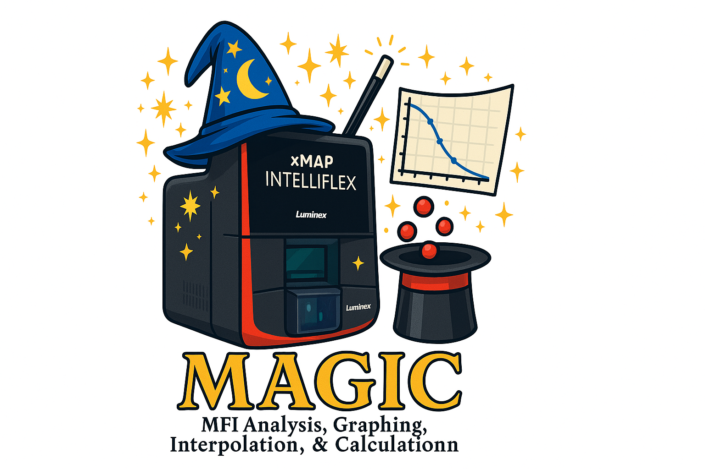

  

# M.A.G.I.C. (MFI Analysis, Graphing, Interpolation, & Calculation)

**A fully browser-based web application for analyzing Luminex data files** — including preprocessing, curve fitting, and data visualization. No installation required.

## 🚀 Overview

**M.A.G.I.C.** is a self-contained HTML application that replicates and extends the functionality of a Python-based Luminex analysis pipeline. It includes:

- CSV parsing (raw Luminex exports, standards, cutoffs, plate layouts)
- Preprocessing of data (handling 96- or 384-well formats)
- Plate layout assignment and validation with conflict detection
- Curve fitting using **SciPy (via Pyodide)** with 4PL regression
- Background correction with configurable sample names
- Hook effect detection with sophisticated peak detection
- Internal Quality Control (IQC) analysis for control samples
- Optional filtering of low-performing standards
- Interactive graphing with **Chart.js** and global axis controls
- Comprehensive quality flagging system (Below_Min_MFI, Above_Max_MFI, In_Hook_Zone, Below_Cutoff)
- Advanced file exports (.csv, .png, .zip) with File System Access API
- HitPicking file generation for robotic liquid handlers

## 🔧 How to Use

1. Open `LuminexExtractorAnalyser.html` in any modern browser (Chrome/Edge/Firefox).
2. Upload your Luminex `.csv` file.
3. Optionally upload Standards, Cutoff, and/or Plate Layout files.
4. Configure output location (File System Access API supported in Chrome/Edge).
5. Adjust analysis options (background sample, dilution factor, hook detection, etc.).
6. Click **Preprocess**, then **Run Analysis**.
7. View results in tabbed interface:
   - **Graphs**: Interactive charts with global log/linear axis controls and PNG export
   - **Data Tables**: Comprehensive data displays with quality flags
   - **IQC Analysis**: Internal Quality Control monitoring and charts
   - **Summary**: Analysis overview, statistics, and parameter details
8. Download outputs individually, as PNG charts, or as a complete ZIP archive.

## 📁 Input Files

- **Luminex Data** (`.csv`): Raw export from Luminex software (96-well or 384-well format).
- **Standards File** (`.csv`, optional): Two columns – `Sample`, `Concentration`
- **Cutoff File** (`.csv`, optional): Two columns – `Analyte`, `Cutoff`
- **Plate Layout File** (`.csv`, optional): Two columns – `Well`, `Sample_ID` for sample assignment validation

## 📦 Output Files

- **Cleaned data CSV**: Processed Luminex data ready for analysis
- **Leftover/unused data CSV**: Excluded metadata and headers
- **Analyte-specific results**: Individual analysis summaries with quality flags
- **Efficiency data CSV**: Standard curve performance metrics (R², CV%)
- **IQC values CSV**: Internal Quality Control sample data
- **Combined results CSV**: All analytes with comprehensive quality flags
- **Samples below min MFI CSV**: Samples requiring higher concentration testing
- **Samples need dilution CSV**: Samples requiring dilution (Above Max MFI/Hook Zone)
- **HitPicking file CSV**: Robotic liquid handler format for automated dilution
- **PNG chart exports**: Standard curve and efficiency visualizations
- **Complete data table CSV**: All samples and analytes in single consolidated file
- **ZIP archive**: All generated results in single downloadable package

## 🧪 Key Features

### Core Functionality
- **Offline Operation**: Works completely offline once loaded
- **Browser-Based**: No server-side code — fully runs in-browser
- **Multi-Format Support**: Compatible with both 96-well and 384-well formats
- **Pyodide Integration**: Native Python curve fitting with SciPy via WebAssembly

### Advanced Analysis
- **4PL Curve Fitting**: Four-parameter logistic regression for dose-response curves
- **Hook Effect Detection**: Automatic detection of high-dose inhibition (5% threshold)
- **Quality Control Flagging**: Comprehensive sample assessment system
- **IQC Analysis**: Dedicated Internal Quality Control monitoring
- **Standards Auto-Detection**: Automatic detection with manual override option

### Data Management
- **Plate Layout Validation**: Conflict detection and missing well identification
- **File System Access API**: Direct save to user-selected directories (Chrome/Edge)
- **Background Correction**: Configurable background sample subtraction
- **Dilution Factor Support**: Concentration adjustment capabilities

### Visualization & Export
- **Interactive Charts**: Chart.js-powered with hover and zoom
- **Global Axis Controls**: Toggle all charts between linear/logarithmic scales
- **PNG Export**: Individual chart export capabilities
- **Tabbed Interface**: Organized results in Graphs, Data Tables, IQC, and Summary tabs
- **Multiple Export Formats**: CSV, PNG, ZIP with batch download options

## ⚙️ Built With

- [Chart.js](https://www.chartjs.org/) – Interactive graphing
- [PapaParse](https://www.papaparse.com/) – CSV parsing
- [JSZip](https://stuk.github.io/jszip/) – ZIP file generation
- [FileSaver.js](https://github.com/eligrey/FileSaver.js/) – Local file downloads
- [Pyodide](https://pyodide.org/) – Python in WebAssembly (SciPy/Numpy)

## 🧠 Developer Notes

### Performance & Compatibility
- **Pyodide Loading**: Initial Python runtime load takes ~5–10s on first use
- **Browser Support**: Full functionality in Chrome/Edge, limited file handling in Firefox/Safari
- **File System Access API**: Enhanced file management in Chrome/Edge 86+

### Data Processing
- **Luminex Compatibility**: Designed for Luminex/Bio-Plex CSV outputs (Milliplex, MagPix, etc.)
- **Standards Inference**: Auto-concentrations inferred if standards file missing (e.g., `Standard1`, `Standard2`)
- **Quality Flag System**: 
  - `Below_Min_MFI`: Samples below lowest standard or negative corrected MFI
  - `Above_Max_MFI`: Samples above highest standard requiring dilution
  - `In_Hook_Zone`: Samples in hook effect region
  - `Below_Cutoff`: Samples below defined concentration thresholds

### Technical Implementation
- **4PL Algorithm**: Uses `scipy.optimize.curve_fit` with robust error handling
- **Hook Detection**: Sophisticated peak detection with 5% concentration decrease threshold
- **IQC Processing**: Automatic detection of samples starting with 'IQC' or 'Control'
- **Plate Layout**: Validates well assignments and detects conflicts/missing wells

## 📜 License

MIT License © 2025